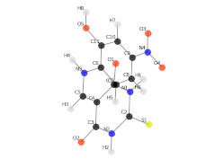

|     Author:    |            Niklas Tiede             |
|----------------|-------------------------------------|
| Documentation: | https://feedingorcas.readthedocs.io |


feedingORCAs
=============




[](https://pypi.org/project/fastai/#description) 
[](https://anaconda.org/fastai/fastai)
[](https://github.com/fastai/docker-containers) 


 
 
 


[](
    https://travis-ci.com/github/numpy/numpy)
[](
    https://dev.azure.com/numpy/numpy/_build/latest?definitionId=5)
[](
    https://codecov.io/gh/numpy/numpy)

[](https://badge.fury.io/py/tensorflow)
[](https://badge.fury.io/py/tensorflow)


[]()    # https://shields.io/category/version
[]()    # https://shields.io/category/platform-support
[]()    # https://shields.io/category/build
[]()    # https://shields.io/category/license


[]()     # https://shields.io/category/build
[]()    # https://shields.io/category/coverage
[]()    # https://shields.io/category/analysis

    # https://shields.io/category/size
    # https://shields.io/category/size


[comment]: <> (test )


goal: an interface for ORCA and a db, rdkit adds also functionality to 
let you work with chemical data.

The goal of this small project is to populate a relational database with
molecular data using RDKit and the quantum chemistry software ORCA.
Molecules can be created using different chemical file formats and
viewed as 3D plot. Several quantum chemical methods can be used for the
calculation of molecule coordinates and other properties.

Requirements
------------

You need Anaconda, a linux environment and the quantum chemistry
software ORCA which is accessible for academic purposes for free. But
even though if you have no access to ORCA, the project lets you build
your own database for molecules by retrieving and calculating molecule
data.

Installation
------------

The dependencies are installed using the `environment_linux.yml` file.
After downloading the code, you can go into the projects folder and
create & activate the conda environment:

``` {.sourceCode .bash}
1. conda env create --file environment_linux.yml
2. conda activate molecule-data-handler
```

Currently the quantum chemistry software ORCA is used to calculate
quantum chemical properties of the data sets. The software can be
requested for free at <https://orcaforum.kofo.mpg.de/app.php/portal> if
used for academic purposes only.

The jupyter notebook `Tutorial.ipynb` gives you an introduction to some
basic functionality of the project.
